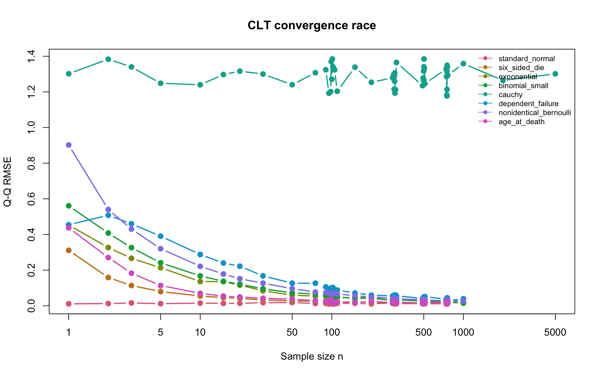

# How Fast Does Normal Happen?

### Stress-testing the Central Limit Theorem with Monte Carlo simulation

**Shayaan Tanveer · Math 167R · R + Quarto**

I asked when a sample average becomes approximately Normal, and whether **n = 30** is a universal rule. It is not: the population shape, discreteness, tails and assumptions all matter.

**[Read my 14-page final report](output/pdf/clt_summary.pdf)** · [Quarto overview](index.qmd) · [Rendered overview](docs/index.html) · [Full numerical summary](results/final_summary.csv)

The PDF is the grading summary: all three assignment questions, an eight-row decision table, histogram/Q-Q evidence for every case, smaller-n reservations, seed sensitivity and real AI corrections. Page 1 guides the professor to each answer. Full tested-grid diagnostics and code walkthroughs stay in the separate investigations below.

## My practical decisions

These are the smallest tested values I am comfortable defending under a practical central-shape approximation. Borderline neighbors may also be defensible; these are not unique mathematical cutoffs or guarantees for extreme-tail probabilities.

| Population | Selected n | Main reason / issue |
|---|---:|---|
| [Standard Normal](analyses/01_standard_normal.qmd) | 1 | Exactly Normal for every positive n. |
| [Six-sided die](analyses/02_six_sided_die.qmd) | 10 | Symmetric bell shape; small short-tail error and discrete steps. |
| [Exponential](analyses/03_exponential.qmd) | 90 | Modest right skew remains; central approximation is useful. |
| [Binomial small](analyses/04_binomial_small.qmd) | 75 | Modest skew and fine steps; size=5 is not sample size n. |
| [Cauchy](analyses/05_cauchy.qmd) | None | Averages remain Cauchy; no population mean or variance. |
| [Dependent failure](analyses/06_extra_dependent_failure.qmd) | 350 | Qualified empirical approximation; no iid SE or proved dependent CLT. |
| [Basketball shots](analyses/07_extra_nonidentical_bernoulli.qmd) | 140 | Small skew; use each shot's probability in the variance. |
| [Synthetic ages](analyses/08_extra_age_at_death.qmd) | 15 | Irregular mixture smooths quickly; not historical mortality data. |



## How I decide

For each n, I simulate **B = 10,000 fresh samples**, then compare their means using histograms, Normal Q-Q plots, skewness, excess kurtosis, Q-Q RMSE and valid theoretical mean/SE. I start broad and refine separately for each population. Normal calibration provides context, not an automatic cutoff. Each investigation explains acceptance, smaller-n reservations, limitations and seed sensitivity.

## Reproduce

Install R and Quarto. From this folder:

```sh
Rscript -e 'renv::restore(prompt = FALSE)'
Rscript scripts/smoke_test.R
Rscript scripts/run_project.R
Rscript scripts/validate_results.R
Rscript scripts/render_summary.R
quarto render
```

The confirmed student seed is **7616**; **7617** is the fixed sensitivity seed. The full run regenerates both simulations, calibration, the evidence-linked summary and figures. Quarto's bundled Typst makes the PDF without a separate TeX installation. The calculations use base R; `knitr` and `rmarkdown` support report rendering, with dependencies recorded by `renv`.

`R/` holds reusable functions; `analyses/` the eight investigations; `results/` diagnostics and explicit judgment inputs; `figures/` summary visuals; `output/pdf/` the submission; `docs/` rendered HTML. Original instructor files are preserved in `references/`.

## AI use

I prompted AI to build and revise the project, questioned the smallest-n reasoning, and approved a practical approximation standard. AI selected the working boundaries under that standard; I did not independently confirm every integer. My responsibility is reviewing the evidence and understanding the important code. The [actual interaction log](ai/ai_interactions.md) distinguishes my input, AI-discovered errors, corrections and checks. See [validation](VALIDATION.md) for the reproducibility record.
