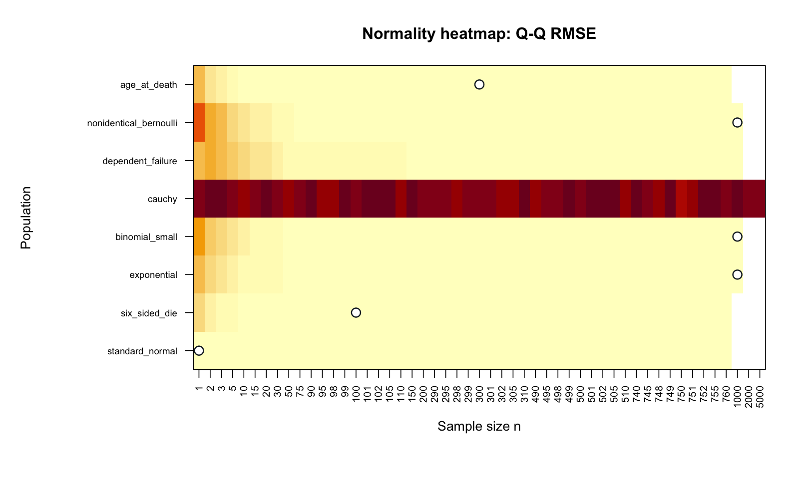

## My answer

I investigated five required populations and all three extra-credit processes, with B = 10,000 separate samples at each n. Normal means are exact at n = 1. The die and synthetic mixture smooth quickly; skew, discrete gaps and dependence require more observations. Cauchy never converges to Normal in this experiment's iid setting.

My standard is a useful central-shape approximation, not exact Normality or extreme-tail accuracy. I combine histograms, Q-Q plots, numerical diagnostics, valid theory and nearby larger values. Borderline neighbors mean there is uncertainty about the exact smallest integer.

[Download the four-page submission PDF](output/pdf/clt_summary.pdf)

```{r}
#| echo: false
source("R/config.R")
source("R/distributions.R")
source("R/diagnostics.R")
source("R/report_helpers.R")
s <- load_final_summary()
stopifnot(nrow(s) == 8)
options(knitr.kable.NA = "N/A")
knitr::kable(s[, c("population", "selected_n", "acceptance_reason",
                   "smaller_n_reason", "key_observation")],
  col.names = c("Population", "Selected n", "Why I accept", "Why not smaller", "Issue / surprise"))
```

## Assumptions and numerical evidence

```{r}
#| echo: false
knitr::kable(s[, c("population", "independent", "identically_distributed",
 "finite_variance", "skewness_at_selected_n", "excess_kurtosis_at_selected_n",
 "qq_rmse_at_selected_n", "empirical_se_at_selected_n", "theoretical_se_or_reference")],
 digits = 3, col.names = c("Population", "Independent", "Identical", "Finite variance",
 "Skewness", "Excess kurtosis", "Q-Q RMSE", "Empirical SE", "Theoretical SE"))
```

N/A for Cauchy means no finite selection and no valid population moment targets. Dependence has finite individual second moments but no supplied theoretical mean or SE for this nonstationary-start process; a dependent CLT is not established here.

## Two views of convergence




## What I take from this

The surprising contrast is that a complicated synthetic population can smooth faster than a simple skewed distribution. Discrete steps are not automatically a failure. Matching a mean and SE does not establish a Normal shape. Dependence changes variance reasoning; non-identical independent shots need individual variances. Heavy tails can invalidate the ordinary CLT altogether.

Each separate investigation includes population shape or process behavior, retrospective theory expectation, important code explanations, boundary plots and both-seed diagnostics. The expectation is not presented as a personal prediction made before the original simulations.

## Reproducibility and AI

The seed is 7616, with fixed sensitivity seed 7617. [Methodology](methodology.qmd), [AI log](ai/ai_interactions.md), [README](README.md) and original instructor references document the workflow. Judgment inputs live in `results/decisions.csv`; `scripts/finalize_summary.R` validates boundary evidence and copies generated diagnostics into the summary. It does not infer normality from a single test or metric.
